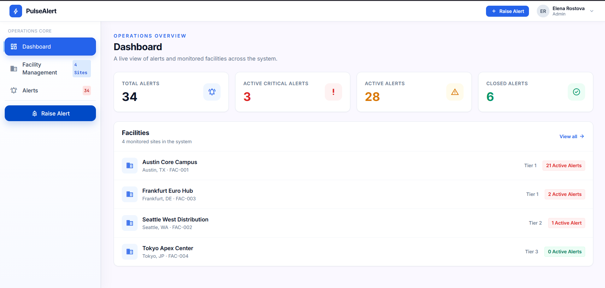
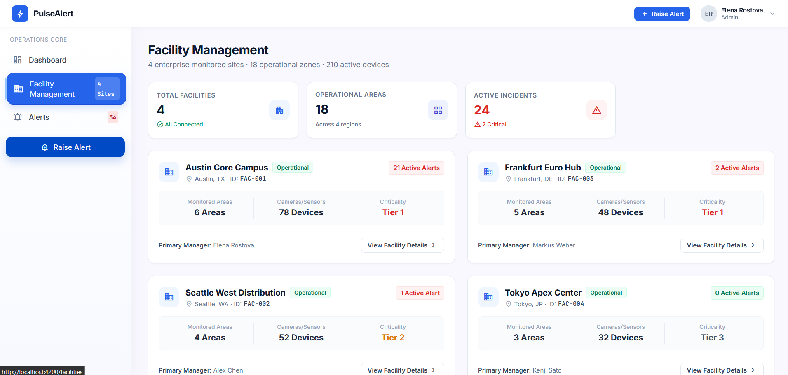
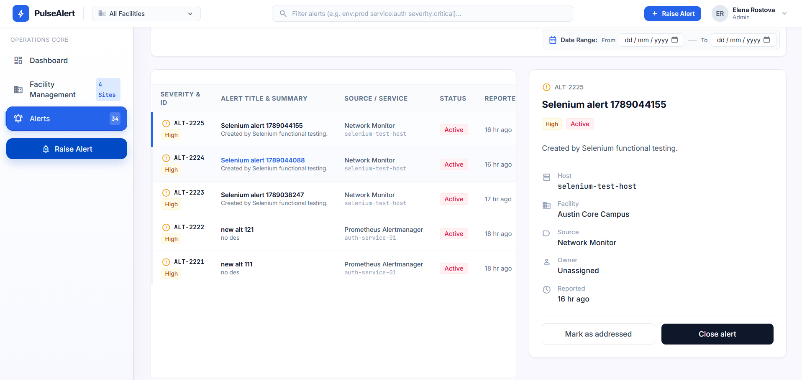
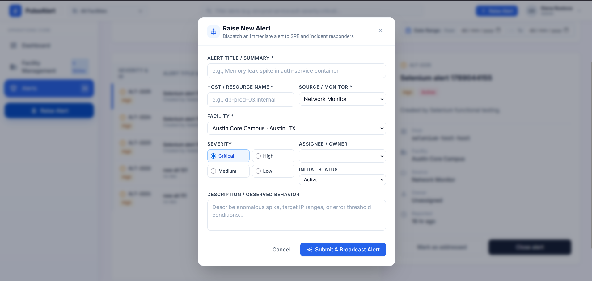

# PulseAlert

PulseAlert is an alert and facility management application for monitoring operational incidents, facilities, alert severity, alert status, and live dashboard metrics.

## Features

- Dashboard with total, critical, active, and closed alert metrics
- Alert listing with search, filtering, pagination, and date ranges
- Create, address, close, and reopen alerts
- Facility management with active-alert statistics
- Facility detail view and facility-specific alert filtering
- REST API backed by MySQL
- Selenium functional testing for frontend workflows

## Tech Stack

- Angular
- TypeScript
- Angular Signals
- CSS
- REST API
- Node.js
- Express
- Sequelize
- MySQL


## Prerequisites

Make sure you have installed:

- Node.js
- npm
- Angular CLI
- MySQL 
- Any browser


## Installation

Clone the repository:

```bash
git clone https://github.com/RuturajDeshmukhDSPL/alertManagement
cd alertManagement
```

### Install backend dependencies

```powershell
cd backend/node-backend
npm install
```

Configure the backend environment:

```powershell
Copy-Item  .env
```

Update `.env` with your MySQL credentials. The frontend is configured to call the backend on port `3000`, so use:

```env
PORT=
DB_HOST=
DB_PORT=
DB_NAME=
DB_USER=
DB_PASSWORD=
CORS_ORIGIN=
```

Create the `alertManagement` database and required tables before seeding the application data.

Seed the database:

```powershell
npm run seed
```

### Install frontend dependencies

Open a second terminal from the project root:

```powershell
cd frontend-angular
npm install
```

## Build Frontend

Build the Angular application for production:

```powershell
cd frontend-angular
npm run build
```

The compiled application is generated in:

```text
dist/pulsealert-angular
```

## Start Backend

From the backend directory:

```powershell
cd backend/node-backend
npm start
```

For development with automatic restart:

```powershell
npm run dev
```

Backend API:

```text
http://localhost:3000
```


## Start Frontend

From the frontend directory:

```powershell
cd pulsealert-angular
npm start -- --port 4200
```

Frontend application:

```text
http://localhost:4200
```

Start the backend before using the frontend so alerts and facilities can load from the API.

## API Endpoints

| Method | Endpoint | Description |
|--------|----------|-------------|
| GET | `/health` | Check API availability |
| GET | `/api/alerts` | List and filter alerts |
| GET | `/api/alerts/:id` | Get one alert |
| POST | `/api/alerts` | Create an alert |
| PUT | `/api/alerts/:id` | Update an alert |
| GET | `/api/facilities` | List facilities |
| GET | `/api/facilities/:id` | Get one facility |
| GET | `/api/dashboard/stats` | Get dashboard statistics |

Example create-alert request:

```json
{
  "title": "Memory leak in auth-service",
  "host": "auth-service-01",
  "source": "Prometheus Alertmanager",
  "severity": "High",
  "status": "Active",
  "facilityId": "FAC-001",
  "description": "Memory usage exceeded the configured threshold."
}
```

## Functional Testing

Install the Selenium dependency:

```powershell
python -m pip install selenium
```

Make sure the backend and frontend are running, then execute the tests from the project root:

```powershell
$env:PULSEALERT_DRIVER="C:\path\to\chromedriver.exe"
$env:PULSEALERT_HEADLESS="0"
$env:PULSEALERT_STEP_DELAY="0.35"
python testing/test_pulsealert.py
```

The test suite opens a visible browser by default and checks dashboard navigation, facilities, filters, pagination, alert creation, alert status changes, closing/reopening alerts, and logout page refresh.

To run without displaying the browser:

```powershell
$env:PULSEALERT_HEADLESS="1"
python testing/test_pulsealert.py
```



